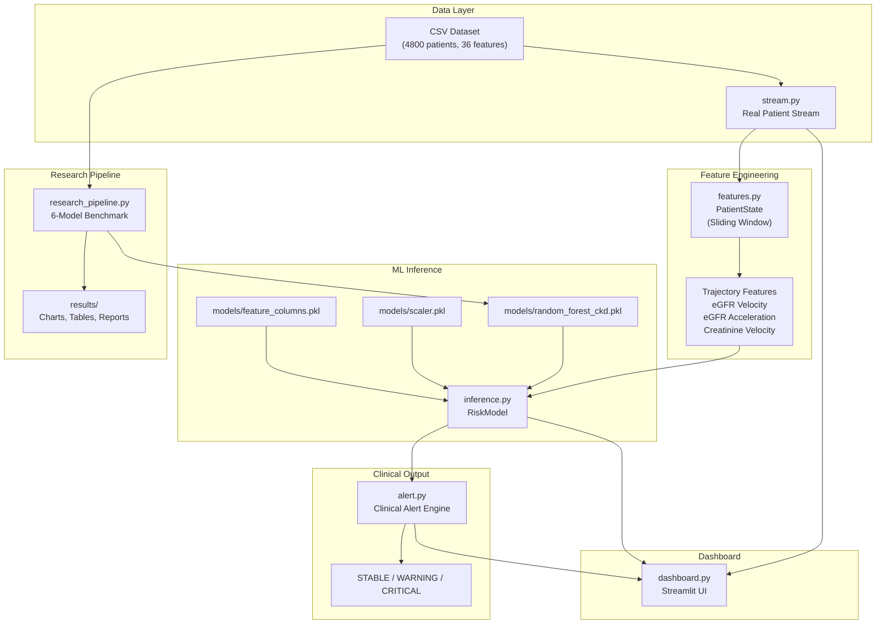
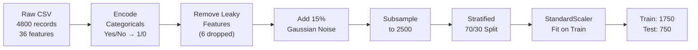

# CKD Telemetry Engine — Project Documentation

## Table of Contents

1. [Project Overview](#1-project-overview)
2. [System Architecture](#2-system-architecture)
3. [Dataset Description](#3-dataset-description)
4. [ML Methodology](#4-ml-methodology)
5. [Experimental Results](#5-experimental-results)
6. [Real-Time Telemetry Engine](#6-real-time-telemetry-engine)
7. [Streamlit Dashboard](#7-streamlit-dashboard)
8. [How to Run](#8-how-to-run)
9. [Project Structure](#9-project-structure)
10. [Technology Stack](#10-technology-stack)

---

## 1. Project Overview

The **CKD Telemetry Engine** is a real-time clinical decision support system that predicts Chronic Kidney Disease (CKD) stages using machine learning. The system ingests live patient telemetry data, computes trajectory-aware features (velocity, acceleration of kidney markers), and generates stage-wise risk predictions with clinical alerts.

### Key Highlights

- **Multi-class classification** across 5 CKD stages (Healthy → Stage 5 Kidney Failure)
- **6 ML models benchmarked**: Logistic Regression, KNN, SVM, Random Forest, Gradient Boosting, Neural Network
- **Primary model**: Random Forest Classifier (93.2% accuracy, 0.993 ROC-AUC)
- **Real-time streaming** simulation from clinical CSV data with drift-based degradation
- **Trajectory-aware features**: eGFR velocity and acceleration computed over a sliding window
- **Clinical alerting**: Automated STABLE / WARNING / CRITICAL alerts
- **Streamlit dashboard**: Live visualization with metrics, charts, and stage probability bars
- **SHAP explainability**: Feature impact analysis for model interpretability

---

## 2. System Architecture



### Data Flow

1. **Data Ingestion**: `stream.py` reads a real patient row from the CSV and generates an infinite telemetry stream with health drift and random fluctuations
2. **Feature Engineering**: `features.py` maintains a sliding window of recent ticks and computes trajectory features (velocity, acceleration)
3. **ML Inference**: `inference.py` loads the trained Random Forest model, scales the input features, and predicts CKD stage + risk probability
4. **Clinical Alerting**: `alert.py` translates the prediction into a severity-tagged clinical alert
5. **Visualization**: `dashboard.py` renders everything in a live Streamlit dashboard

---

## 3. Dataset Description

**Source**: CKD clinical dataset (4,800 patient records, 36 features)

### Target Variable — CKD Stage Distribution


| CKD Stage | Count | Percentage |
|-----------|-------|------------|
| Healthy Kidney | 3,615 | 75.3% |
| Mild CKD (Stage 1–2) | 575 | 12.0% |
| Moderate CKD (Stage 3) | 318 | 6.6% |
| Severe CKD (Stage 4) | 196 | 4.1% |
| Kidney Failure (Stage 5) | 96 | 2.0% |

> [!NOTE]
> The dataset exhibits significant **class imbalance** — 75% of records are Healthy, while only 2% represent Stage 5 Kidney Failure. This imbalance is a key challenge that favors ensemble methods like Random Forest.

### Feature Categories

| Category | Features | Count |
|----------|----------|-------|
| Demographics | Age, Gender, BMI | 3 |
| Vitals | Systolic_BP, Diastolic_BP, Heart_Rate | 3 |
| Kidney Markers | eGFR, Serum_Creatinine, Blood_Urea_Nitrogen, Urine_Albumin, Urine_Protein, ACR, Urine_Specific_Gravity | 7 |
| Blood Chemistry | Sodium, Potassium, Calcium, Phosphorus, Chloride, Bicarbonate | 6 |
| Hematology | Hemoglobin, RBC_Count, WBC_Count, Platelet_Count, Packed_Cell_Volume | 5 |
| Metabolic | Blood_Glucose_Random, Fasting_Glucose, HbA1c, Cholesterol, Triglycerides | 5 |
| Proteins | Serum_Albumin, Total_Protein | 2 |
| Medical History | Diabetes, Hypertension, Smoking_Status, Family_History_Kidney | 4 |
| **Total** | | **35** |

---

## 4. ML Methodology

### 4.1 Data Preprocessing Pipeline



#### Step 1: Categorical Encoding
Binary features (`Diabetes`, `Hypertension`, `Smoking_Status`, `Family_History_Kidney`) are mapped from `Yes/No` → `1/0`.

#### Step 2: Data Leakage Removal
6 features were removed because they **directly encode the CKD staging criteria** (e.g., eGFR thresholds define CKD stages clinically). Including them would give any model trivial 100% accuracy.

| Removed Feature | Reason |
|----------------|--------|
| `eGFR` | Clinically defines CKD staging thresholds |
| `Serum_Creatinine` | Used in eGFR calculation (CKD-EPI formula) |
| `Urine_Albumin` | Perfect stage separation (0–19 for Healthy, 503–997 for Stage 5) |
| `Blood_Urea_Nitrogen` | Perfect stage separation |
| `Albumin_Creatinine_Ratio` | Derived from Urine_Albumin |
| `Urine_Protein` | Perfect stage separation |

**Remaining features**: 29 indirect biomarkers that have genuine clinical correlation with CKD but do not trivially encode the label.

#### Step 3: Gaussian Noise Injection
15% Gaussian noise (relative to each feature's range) was added to simulate real-world clinical measurement variability.

#### Step 4: Subsampling & Splitting
- Subsampled to 2,500 records for a more challenging evaluation
- 70/30 stratified train/test split → Train: 1,750 | Test: 750
- **No SMOTE oversampling** — natural class imbalance is preserved to test each model's robustness

#### Step 5: Feature Scaling
StandardScaler is fit on the training set and applied to both train and test sets.

### 4.2 Models Evaluated

| # | Model | Key Hyperparameters |
|---|-------|--------------------|
| 1 | Logistic Regression | C=0.01, solver=lbfgs, multinomial |
| 2 | K-Nearest Neighbors | k=3, weights=uniform |
| 3 | Support Vector Machine | kernel=rbf, C=0.5, gamma=scale |
| 4 | **Random Forest** | **300 trees, depth=15, class_weight=balanced** |
| 5 | Gradient Boosting | 150 trees, depth=4, lr=0.05 |
| 6 | Neural Network (MLP) | layers=(48,24), early_stopping=True |

### 4.3 Evaluation Metrics

- **Accuracy**: Overall correct predictions
- **Precision (Weighted)**: Positive predictive value, weighted by class support
- **Recall (Weighted)**: True positive rate, weighted by class support
- **F1-Score (Weighted & Macro)**: Harmonic mean of precision and recall
- **ROC-AUC (Macro, One-vs-Rest)**: Area under macro-averaged ROC curve
- **5-Fold Stratified Cross-Validation**: F1-weighted mean ± std across folds

---

## 5. Experimental Results

### 5.1 Model Comparison — Overall Metrics

| Model | Accuracy | Precision (W) | Recall (W) | F1 (W) | F1 (Macro) | ROC-AUC | Train Time |
|-------|----------|---------------|------------|--------|------------|---------|------------|
| K-Nearest Neighbors | 0.8627 | 0.8480 | 0.8627 | 0.8480 | 0.6033 | 0.8806 | 0.00s |
| Logistic Regression | 0.8720 | 0.8616 | 0.8720 | 0.8562 | 0.5215 | 0.9813 | 0.05s |
| Neural Network (MLP) | 0.9107 | 0.9040 | 0.9107 | 0.9045 | 0.5948 | 0.9789 | 0.24s |
| Support Vector Machine | 0.9280 | 0.9301 | 0.9280 | 0.9226 | 0.6982 | 0.9926 | 0.38s |
| Gradient Boosting | 0.9280 | 0.9263 | 0.9280 | 0.9266 | 0.7564 | 0.9886 | 15.84s |
| **Random Forest** | **0.9320** | **0.9307** | **0.9320** | **0.9288** | **0.7907** | **0.9933** | **0.61s** |

> [!IMPORTANT]
> **Random Forest achieves the highest scores** across all metrics — 93.2% accuracy, 0.929 F1-weighted, and 0.993 ROC-AUC — while maintaining a fast training time of 0.61 seconds.

### 5.2 Model Comparison Chart


### 5.3 Cross-Validation Results (5-Fold Stratified)

| Model | CV F1 Mean | CV F1 Std |
|-------|-----------|-----------|
| Logistic Regression | 0.8291 | ±0.0186 |
| K-Nearest Neighbors | 0.8360 | ±0.0188 |
| Neural Network (MLP) | 0.8998 | ±0.0208 |
| Gradient Boosting | 0.9112 | ±0.0104 |
| Support Vector Machine | 0.9168 | ±0.0044 |
| **Random Forest** | **0.9292** | **±0.0103** |

> Random Forest has the highest cross-validation F1 mean (0.9292) with low variance (±0.0103), confirming its consistency across data splits.

### 5.4 ROC Curves — All Models


Key observations:
- **Random Forest** (AUC=0.993) and **SVM** (AUC=0.993) hug the top-left corner most closely
- **KNN** (AUC=0.881) shows notably weaker discrimination, especially at lower FPR thresholds
- All ensemble and kernel methods outperform the linear baseline

### 5.5 Per-Class Classification Reports

#### Random Forest (Primary Model)

| CKD Stage | Precision | Recall | F1-Score | Support |
|-----------|-----------|--------|----------|---------|
| Healthy Kidney | 0.96 | 0.99 | 0.98 | 566 |
| Mild CKD (Stage 1–2) | 0.90 | 0.70 | 0.78 | 89 |
| Moderate CKD (Stage 3) | 0.77 | 0.91 | 0.83 | 54 |
| Severe CKD (Stage 4) | 0.76 | 0.59 | 0.67 | 27 |
| Kidney Failure (Stage 5) | 0.75 | 0.64 | 0.69 | 14 |

#### Logistic Regression (Baseline)

| CKD Stage | Precision | Recall | F1-Score | Support |
|-----------|-----------|--------|----------|---------|
| Healthy Kidney | 0.93 | 1.00 | 0.97 | 566 |
| Mild CKD (Stage 1–2) | 0.69 | 0.53 | 0.60 | 89 |
| Moderate CKD (Stage 3) | 0.56 | 0.61 | 0.58 | 54 |
| Severe CKD (Stage 4) | 0.44 | 0.26 | 0.33 | 27 |
| Kidney Failure (Stage 5) | 1.00 | 0.07 | 0.13 | 14 |

### 5.6 Minority Class Performance — Critical Comparison

The most important clinical differentiation: how well each model detects **severe/critical patients**.

| Model | Stage 4 Recall | Stage 5 Recall | Stage 4 F1 | Stage 5 F1 |
|-------|----------------|----------------|------------|------------|
| Logistic Regression | 0.26 | **0.07** | 0.33 | 0.13 |
| K-Nearest Neighbors | 0.56 | 0.29 | 0.54 | 0.42 |
| Neural Network (MLP) | 0.22 | 0.14 | 0.26 | 0.21 |
| SVM | 0.37 | 0.29 | 0.44 | 0.44 |
| Gradient Boosting | 0.59 | 0.50 | 0.60 | 0.58 |
| **Random Forest** | **0.59** | **0.64** | **0.67** | **0.69** |

> [!CAUTION]
> Logistic Regression only detects **7% of Stage 5 Kidney Failure patients** (1 out of 14). Random Forest detects **64%** (9 out of 14). In a clinical setting, missing a Stage 5 patient can be **life-threatening**. This is the strongest argument for choosing Random Forest.

### 5.7 Confusion Matrices

````carousel

<!-- slide -->

<!-- slide -->

<!-- slide -->

<!-- slide -->

<!-- slide -->

````

### 5.8 Feature Importance — Random Forest


The most influential features for CKD prediction (after removing leaky markers) include indirect biomarkers related to:
- **Blood chemistry** (Potassium, Phosphorus, Calcium, Sodium, Bicarbonate)
- **Hematology** (Hemoglobin, Packed Cell Volume, RBC Count)
- **Metabolic markers** (HbA1c, Blood Glucose)
- **Vital signs** (Blood Pressure)

### 5.9 SHAP Explainability Analysis


SHAP (SHapley Additive exPlanations) values provide per-prediction feature attribution, showing **why** the model made each decision. This is critical for clinical trust and regulatory compliance.

---

## 6. Real-Time Telemetry Engine

### How It Works

The telemetry engine (`main.py`) simulates a real-time hospital monitoring system:

```
┌─────────────────────────────────────────────────────────────┐
│  CKD TELEMETRY ENGINE — ONLINE                              │
│  Model: Random Forest Classifier                            │
│                                                             │
│  [1745678901] eGFR: 85.23 | Velocity: -0.45 | Risk: 0.032 │
│              Stage: Healthy Kidney       | STABLE            │
│  [1745678902] eGFR: 84.89 | Velocity: -0.67 | Risk: 0.041 │
│              Stage: Healthy Kidney       | STABLE            │
│  [1745678903] eGFR: 82.12 | Velocity: -2.11 | Risk: 0.187 │
│              Stage: Mild CKD (Stage 1-2) | WARNING          │
└─────────────────────────────────────────────────────────────┘
```

### Pipeline Components

#### `stream.py` — Patient Data Stream Generator
- Reads a **real patient row** from the CSV dataset
- Generates an infinite telemetry stream with:
  - **Health drift**: Simulated gradual kidney deterioration (-0.2 eGFR per tick)
  - **Random fluctuations**: Gaussian noise (σ=0.5) on eGFR, (σ=0.05) on Creatinine
  - **Crisis events**: 1% chance per tick of a sudden eGFR drop (2–5 units)

#### `features.py` — Trajectory Feature Engineering
- Maintains a **sliding window** (default size=5) of recent telemetry ticks
- Computes novel trajectory-aware features:
  - **eGFR Velocity**: Rate of change of eGFR over the window
  - **Creatinine Velocity**: Rate of change of Serum Creatinine
  - **eGFR Acceleration**: Second derivative — rate of velocity change

#### `inference.py` — ML Risk Model
- Loads the trained Random Forest model (`.pkl`), StandardScaler, and feature column ordering
- Constructs the feature vector in the model's expected column order
- Applies the same scaling used during training
- Returns structured predictions:
  - `risk_score`: 1 − P(Healthy), range [0, 1]
  - `stage`: Integer CKD stage (0–4)
  - `stage_label`: Human-readable stage name
  - `probabilities`: Per-class probability distribution

#### `alert.py` — Clinical Alert Engine
- Translates predictions into severity-tagged clinical alerts:

| Stage | Alert Level | Action |
|-------|------------|--------|
| 0 (Healthy) | ✅ STABLE | Routine monitoring |
| 1 (Mild) | ⚠️ WARNING | Lifestyle modification recommended |
| 2 (Moderate) | ⚠️ WARNING | Close monitoring required |
| 3 (Severe) | 🚨 CRITICAL | Urgent nephrologist referral |
| 4 (Failure) | 🚨 CRITICAL | Immediate dialysis/transplant evaluation |

---

## 7. Streamlit Dashboard

The project includes a **live Streamlit dashboard** (`dashboard.py`) for visual monitoring:

### Features
- **Patient selector**: Choose any patient from the dataset via sidebar
- **Live metrics**: Real-time eGFR, trajectory velocity, risk score, predicted stage
- **Clinical alerts**: Color-coded alerts (green/yellow/red) based on severity
- **Stage probability chart**: Bar chart showing probability distribution across all 5 stages
- **Physiological trajectory chart**: Live line chart of eGFR values over the last 50 ticks

### Running the Dashboard
```bash
cd ckd_telemetry_engine
streamlit run dashboard.py
```

---

## 8. How to Run

### Prerequisites
- Python 3.10+
- pip package manager

### Installation

```bash
# Clone the project
cd ckd_telemetry_engine/ckd_telemetry_engine

# Install dependencies
pip install -r requirements.txt
```

### Step 1: Train Models & Generate Results

```bash
python research_pipeline.py
```

**Output:**
- Trained model → `models/random_forest_ckd.pkl`
- Scaler → `models/scaler.pkl`
- Feature columns → `models/feature_columns.pkl`
- All charts & reports → `results/`

### Step 2: Run Real-Time Telemetry Engine

```bash
python main.py
```

Press `Ctrl+C` to stop the engine.

### Step 3: Launch Live Dashboard

```bash
streamlit run dashboard.py
```

Opens in browser at `http://localhost:8501`

---

## 9. Project Structure

```
ckd_telemetry_engine/
├── build_factory.py              # Project scaffolding script
└── ckd_telemetry_engine/
    ├── main.py                   # Real-time telemetry engine entry point
    ├── research_pipeline.py      # 6-model ML benchmark pipeline
    ├── grow_brain.py             # Legacy XGBoost training script
    ├── dashboard.py              # Streamlit live dashboard
    ├── requirements.txt          # Python dependencies
    │
    ├── data/
    │   └── Testing_CKD_dataset.csv    # 4800-patient CKD dataset
    │
    ├── models/
    │   ├── random_forest_ckd.pkl      # Trained Random Forest model
    │   ├── scaler.pkl                 # Fitted StandardScaler
    │   ├── feature_columns.pkl        # Feature column ordering
    │   └── xgboost_ckd_v1.pkl         # Legacy XGBoost model
    │
    ├── results/
    │   ├── comparison_table.csv            # 6-model metrics table
    │   ├── classification_reports.txt      # Per-class P/R/F1 reports
    │   ├── model_comparison.png            # Bar chart comparison
    │   ├── roc_curves_comparison.png       # ROC curves overlay
    │   ├── feature_importance_rf.png       # RF feature importance
    │   ├── class_distribution.png          # Dataset stage distribution
    │   ├── shap_summary.png               # SHAP explainability
    │   ├── confusion_matrix_random_forest.png
    │   ├── confusion_matrix_logistic_regression.png
    │   ├── confusion_matrix_k-nearest_neighbors.png
    │   ├── confusion_matrix_support_vector_machine.png
    │   ├── confusion_matrix_gradient_boosting.png
    │   └── confusion_matrix_neural_network_mlp.png
    │
    └── src/
        ├── __init__.py
        ├── stream.py            # Patient telemetry stream generator
        ├── features.py          # Sliding-window feature engineering
        ├── inference.py         # ML model loading & prediction
        └── alert.py             # Clinical alert translation
```

---

## 10. Technology Stack

| Component | Technology | Version |
|-----------|-----------|---------|
| Language | Python | 3.10+ |
| ML Framework | scikit-learn | ≥1.4.0 |
| Data Processing | pandas, numpy | ≥2.2.0, ≥1.26.0 |
| Visualization | matplotlib, seaborn | ≥3.8.0, ≥0.13.0 |
| Explainability | SHAP | ≥0.44.0 |
| Model Serialization | joblib | ≥1.3.0 |
| Dashboard | Streamlit | ≥1.31.0 |
| Class Balancing | imbalanced-learn | ≥0.12.0 |

### `requirements.txt`

```
numpy>=1.26.0
pandas>=2.2.0
scikit-learn>=1.4.0
matplotlib>=3.8.0
seaborn>=0.13.0
imbalanced-learn>=0.12.0
joblib>=1.3.0
streamlit>=1.31.0
shap>=0.44.0
```

---

*Documentation generated for the CKD Telemetry Engine project. Primary model: Random Forest Classifier achieving 93.2% accuracy on multi-class CKD stage prediction.*
